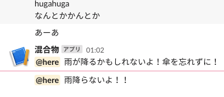

# 雨が降るよ！bot

雨予報のある日の朝に傘を忘れないようにリマインドしてくれるSlackbotです。

### DEMO

写真はデモなので夜ですが、本来は7:30に通知が飛びます。

雨が降る日には「雨が降るかもしれないよ！傘を忘れずに！」と, 雨が降らない日は「雨降らないよ！！」と通知します。

### Requirements

* python3.7

以下, PythonのPackage

* beautifulsoup4           4.8.0

* schedule                 0.6.0

* slacker                  0.13.0

* requests                 2.22.0

### install

`$ pip install -r requirements.txt`